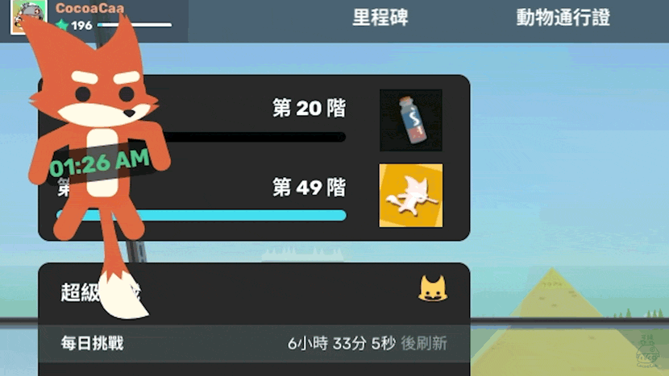
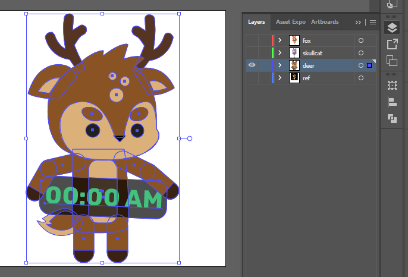

# sar-animal-clock

Super Animal Clock Widget

A Super Animal Royale-styled HTML Clock

Check out the full demo video here: https://youtu.be/myGBRD8zZD8

## Installation

- Open [OBS (Open Broadcaster Software)](https://obsproject.com/)
- Under the Sources box, click "+" and add "Browser Source"
- On the Browser Source pop-up, enter the following URL:
  https://obs-browser-components.cocoacaa.com/sar-animal-clock/
- Click "OK" and the cute clock should appear in the screen now!

## Variations

`animal=<value>`

Values: `fox`, `skullcat`, `deer`

For example: https://obs-browser-components.cocoacaa.com/sar-animal-clock/?animal=deer

- - -

## Art Details

I redraw the animals vector images from the game to ensure that it appears cleanly in any resolution. Afterwarsd, I export it to SVG format (found in [public/animals](public/animals))

## Disclaimer

Super Animal Royale is under copyright by Pixile, Inc and is not affilaited with this project.
